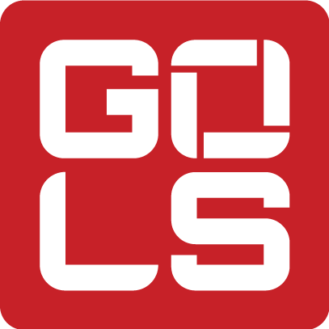

# Game On Live Studio (GOLS) Brand & Style Guide

> **Repo location:** `brand/guidelines.md` · Logos: `brand/logos/` · Tokens: `brand/tokens.json`  
> Applied automatically to every project from this template. Agents: also read `.cursor/rules/006-brand.mdc`.

_Last updated: 2026-06-30_

A practical reference for **designers, developers, marketers, social media managers, live-stream production staff, and AI tools** creating assets for **Game On Live Studio (GOLS)**.

---

## Table of Contents

1. [Quick Brand Summary](#quick-brand-summary)
2. [Brand Personality](#brand-personality)
3. [Voice and Tone](#voice-and-tone)
4. [Brand Name Usage](#brand-name-usage)
5. [Logo Usage](#logo-usage)
6. [Color System](#color-system)
7. [Typography System](#typography-system)
8. [Layout and Visual Style](#layout-and-visual-style)
9. [Accessibility Rules](#accessibility-rules)
10. [Social Media Guidelines](#social-media-guidelines)
11. [Broadcast / Live Stream Graphics Guidelines](#broadcast--live-stream-graphics-guidelines)
12. [Web / App Guidelines](#web--app-guidelines)
13. [Email Guidelines](#email-guidelines)
14. [Copywriting Examples](#copywriting-examples)
15. [AI Prompting Guidance](#ai-prompting-guidance)
16. [Final Checklist](#final-checklist)

---

## Quick Brand Summary

| Element | Standard |
|---|---|
| **Brand name** | Game On Live Studio (title case in body copy) |
| **Abbreviation** | GOLS (after full name is introduced) |
| **What we do** | Live streaming for youth sports — connecting parents, families, athletes, coaches, and fans |
| **Brand feel** | Energetic, exciting, connected, fun, clear, professional, sports-first |
| **Primary logo** | Square GOLS mark (Cardinal Red) — `logos/gols-logo-primary-red.png` |
| **Secondary logo** | Horizontal logo: GOLS mark + **Game On Live Studio** wordmark — see [Logo Assets](#logo-assets) |
| **Logo files** | All approved logo assets live in [`brand/logos/`](logos/) |
| **Primary color** | Cardinal Red `#c62128` |
| **Primary neutrals** | Black `#000000`, Pumice Grey `#c7c9c7`, Gallery Grey `#f0efef` |
| **Secondary colors** | William Green `#37605f`, Zodiac Blue `#0f1c41`, Picton Blue `#4dc7e4` |
| **Display font** | Orbitron — sparing use only |
| **Heading font** | Oswald — all caps |
| **Body font** | Roboto |

**Core rule:** Designs should feel fun and energetic without being overly juvenile. Always respect athletes, teams, coaches, officials, and families.

---

## Brand Personality

GOLS is a **confident live sports production partner** — energetic, clear, helpful, and excited about the athletes and communities we serve.

### Personality traits

| Trait | What it means in practice |
|---|---|
| **Energetic** | Visuals and copy bring excitement to games, moments, and events |
| **Connected** | We bridge viewers to athletes, families, and communities |
| **Professional** | Production quality and communication are reliable and trustworthy |
| **Approachable** | New viewers can follow along without expert knowledge |
| **Sports-first** | Athletes and the event are always the focus — not the brand |
| **Respectful** | We celebrate without talking down to anyone involved |

### Audience

GOLS primarily communicates with:

- Parents and families watching athletes online
- Youth and amateur sports organizations
- Athletes and coaches
- Event operators and venue partners
- Advertisers and sponsors
- Contractors, streamers, commentators, and production staff

Use an **influential but understandable voice** that helps people appreciate sports they may not know well. Avoid overly technical explanations unless the audience clearly needs them.

---

## Voice and Tone

### Core tone attributes

| Attribute | Do | Don't |
|---|---|---|
| **Energetic** | Bring excitement to games, moments, athletes, and events | Use flat, generic, or corporate language |
| **Clear** | Make instructions and information easy to understand quickly | Bury key info in long paragraphs or jargon |
| **Positive** | Celebrate athletes, teams, families, and the sport | Put down a player, coach, official, team, or organization |
| **Welcoming** | Help new viewers understand what is happening | Assume everyone knows the rules or terminology |
| **Respectful** | Treat all participants with dignity | Use humor at the expense of athletes, teams, families, or officials |

### Humor

Irreverent humor may be used when appropriate — especially in social captions or light promotional copy — but it **must never** come at the expense of athletes, teams, families, or officials.

### Sports language

Use language understandable to viewers who may not know every rule. Explain the moment without overcomplicating it.

**Do:**
> Big stop by the goalie to keep this one tied late in the fourth.

**Don't:**
> Textbook weak-side rotation failure on the 6-on-5 read.

The second example may work for a technical audience, but not for general GOLS-facing copy.

---

## Brand Name Usage

### Correct usage

| Format | When to use |
|---|---|
| **Game On Live Studio** | First mention, formal materials, legal copy, partner-facing documents |
| **GOLS** | After the full name has been introduced; tight layouts; repeat mentions |

**Example:**
> Game On Live Studio (GOLS) provides live streaming coverage for youth sports events across the country.

### Don't use

- game on live studio
- GameOn Live Studio
- Game On Livestream Studio
- G.O.L.S.
- Gols

---

## Logo Usage

### Logo assets

All approved logo files are stored in the [`logos/`](logos/) folder. Use these filenames — do not rename or edit the source files.

| File | Logo | Color treatment | Use on |
|---|---|---|---|
| [`gols-logo-primary-red.png`](logos/gols-logo-primary-red.png) | Primary square mark | Red mark, white **GOLS** letterforms | White, light grey, or dark backgrounds; app icons; avatars; watermarks |
| [`gols-logo-secondary-black-text.png`](logos/gols-logo-secondary-black-text.png) | Secondary horizontal | Red mark + black **Game On Live Studio** wordmark | White or light backgrounds (Gallery Grey, Pumice Grey) |
| [`gols-logo-secondary-white-text.png`](logos/gols-logo-secondary-white-text.png) | Secondary horizontal | Red mark + white **Game On Live Studio** wordmark | Black, Zodiac Blue, or dark photography |
| [`gols-logo-secondary-all-white.png`](logos/gols-logo-secondary-all-white.png) | Secondary horizontal | All-white mark and wordmark | Dark backgrounds where the red mark would compete with the layout |
| [`gols-logo-secondary-all-black-reference.png`](logos/gols-logo-secondary-all-black-reference.png) | Layout reference sheet | All-black lockups (stacked, mark-only, centered mark) | Internal reference only — extract individual lockups for production use |




### Logo versions

| Logo | Description | When to use |
|---|---|---|
| **Primary logo** | Red square GOLS mark — `logos/gols-logo-primary-red.png` | Audience already knows GOLS; limited space; icons; watermarks |
| **Secondary logo** | GOLS mark + **Game On Live Studio** wordmark — see [Logo assets](#logo-assets) | New audience; partner/sponsor materials; first impressions |

### Color variant selection

| Background | File to use |
|---|---|
| White, Gallery Grey `#f0efef`, Pumice Grey `#c7c9c7` | `gols-logo-secondary-black-text.png` |
| Black `#000000`, Zodiac Blue `#0f1c41`, dark photos | `gols-logo-secondary-white-text.png` |
| Dark backgrounds where red mark is too dominant | `gols-logo-secondary-all-white.png` |
| Any approved background (compact placement) | `gols-logo-primary-red.png` |
| Cardinal Red or non-brand colors | **Do not use** — choose a different background or add a white bounding box on photography |

### Logo selection guide

| Use case | Recommended logo |
|---|---|
| Audience already knows GOLS | Primary square mark |
| New audience or first impression | Secondary horizontal logo |
| App icon, social avatar, watermark | Primary square mark |
| Sponsor deck or partner document | Secondary horizontal logo |
| Website header (when space allows) | Secondary horizontal logo |
| Mobile or tight layout | Primary square mark |

### Minimum size

| Logo | Minimum size | Fallback |
|---|---|---|
| Horizontal (secondary) logo | **0.5 in** height | Switch to primary mark if smaller |
| Primary square mark | **0.25 in** or **16 px** | Do not use below this size |

### Clear space

Maintain clear space around the logo equal to the **internal spacing between the characters in the primary logo and the outer edge of the red square**.

This rule applies to both the primary square mark and the secondary horizontal logo.

### Approved backgrounds

The GOLS logo may appear on:

- White backgrounds
- Light grey backgrounds from the brand palette (Pumice Grey, Gallery Grey)
- Dark backgrounds from the brand palette (Black, Zodiac Blue)
- Photography — **only** when the logo remains clearly legible

### White bounding box

When the logo is placed on an image or colored background and legibility is at risk, use a **white bounding box** to preserve clarity and protect the logo.

### Photography rules

The logo may appear on a photo only when:

- The photo has enough clean space
- The logo remains readable
- The logo does **not** cover an athlete's face
- The logo does **not** interfere with important action in the image

### Logo do's and don'ts

| Do | Don't |
|---|---|
| Use the correct logo version for the audience and space | Stretch, squash, or distort the logo |
| Maintain required clear space | Rotate the logo |
| Use a white bounding box when legibility is at risk | Recolor the logo outside approved usage |
| Place on white, brand greys, or brand dark colors | Place the logo on **Cardinal Red** or non-brand colors |
| Keep the logo off faces and busy areas of photos | Place the logo over a face or busy photography without a bounding box |

---

## Color System

GOLS uses a simple, energetic palette. Designs should primarily use **white, black, and greyscale**, reserving color for meaningful hierarchy, calls to action, categories, or emphasis.

### Primary colors

| Color | Role | Pantone | CMYK | RGB | HEX |
|---|---|---:|---|---|---|
| **Cardinal Red** | Main brand color, CTAs, buttons, emphasis | 711 C | C15 M100 Y97 K5 | 198, 33, 40 | `#c62128` |
| **Black** | Primary typography, dark backgrounds | Black 6 C | C0 M0 Y0 K0 | 0, 0, 0 | `#000000` |
| **Pumice Grey** | Lower hierarchy, inactive elements, supporting info | 420 C | C22 M16 Y18 K0 | 199, 201, 199 | `#c7c9c7` |
| **Gallery Grey** | Borders, subtle backgrounds, structural elements | 663 C | C4 M4 Y3 K0 | 240, 239, 239 | `#f0efef` |

### Secondary colors

Use secondary colors **sparingly and with purpose** — especially when more than one color is needed for categories, infographics, or data visualization.

| Color | Role | Pantone | CMYK | RGB | HEX |
|---|---|---:|---|---|---|
| **William Green** | Field-oriented sports or category coding | 4167 C | C79 M47 Y55 K26 | 55, 96, 95 | `#37605f` |
| **Zodiac Blue** | Team-oriented themes; softer alternative to black | 289 C | C100 M91 Y41 K50 | 15, 28, 65 | `#0f1c41` |
| **Picton Blue** | Secondary accent; approachable attention color | 2198 C | C60 M0 Y8 K0 | 77, 199, 228 | `#4dc7e4` |

### Color usage rules

| Color | Use for | Avoid |
|---|---|---|
| **Cardinal Red** | Primary buttons, CTAs, key emphasis, urgent hierarchy | Large background fills; red logo on red background; long red text blocks |
| **Black** | Primary text, strong contrast, dark section backgrounds | — |
| **Pumice Grey** | Secondary information, inactive states, muted UI elements | Primary text on light backgrounds (insufficient contrast) |
| **Gallery Grey** | Borders, dividers, light backgrounds, subtle structure | — |
| **William Green** | Field/sport category coding | Decorative use without meaning |
| **Zodiac Blue** | Team themes, dark alternative backgrounds | Competing with Cardinal Red for primary emphasis |
| **Picton Blue** | Secondary accent, approachable highlights | Overuse alongside other secondary colors |

**Rule:** Do not decorate with extra colors just to make a design feel busier. Secondary colors must add meaning.

### CSS variables

```css
:root {
  --gols-cardinal-red: #c62128;
  --gols-black: #000000;
  --gols-pumice-grey: #c7c9c7;
  --gols-gallery-grey: #f0efef;
  --gols-william-green: #37605f;
  --gols-zodiac-blue: #0f1c41;
  --gols-picton-blue: #4dc7e4;
}
```

---

## Typography System

### Font roles

| Font | Role | Usage |
|---|---|---|
| **Orbitron** | Display | Large dramatic headings or numerical figures only — use sparingly |
| **Oswald** | Headings | Most headings; **always all caps** |
| **Roboto** | Body | Paragraphs, descriptions, interface text, long-form copy, email |

### Orbitron (display)

Orbitron is derived from the style of the logo mark.

**Use for:**
- Large dramatic headlines
- Score or stat moments
- Big numerical figures
- Special graphic treatments

**Do not use for:**
- Paragraphs, small labels, long headings, or customer service copy

### Oswald (headings)

Oswald is the primary heading font and appears in the horizontal logo. It is condensed, bold, and efficient for high-impact sports layouts.

- Use Oswald for most headings
- Use Oswald in **all caps**
- Do not use Oswald for long body text

### Roboto (body)

Roboto is the main body font — highly legible and pairs well with Oswald.

**Use for:** body copy, captions, instructions, emails, UI descriptions, and support content.

### Web text hierarchy

| Element | Font | Weight | Size | Line Height | Letter Spacing | Case |
|---|---|---:|---:|---:|---:|---|
| H1 | Oswald | Medium (500) | 42 px | 42 px | 0.01 em | All caps |
| H2 | Oswald | Medium (500) | 36 px | 36 px | 0.01 em | All caps |
| H3 | Oswald | Medium (500) | 25 px | 25 px | 0.01 em | All caps |
| H4 | Oswald | Medium (500) | 20 px | 20 px | 0.2 em | All caps |
| Body | Roboto | Regular (400) | 16 px | 29 px | Default | Sentence case |

### Typography rules

| Rule | Standard |
|---|---|
| Default text color | Black on light backgrounds; white on dark backgrounds |
| Red text | Cardinal Red for key emphasis only — not for long paragraphs |
| Color consistency | If H2s on the homepage are Cardinal Red, all H2s on the site follow the same rule |
| Dark backgrounds | Body copy is white; increase weight to **medium (500)** for legibility |
| Font availability | Oswald and Roboto are Google Fonts — use for standard web and digital work |
| Fallback stack | `"Roboto", Arial, sans-serif` (body); `"Oswald", Impact, sans-serif` (headings) |

### Example CSS

```css
body {
  font-family: "Roboto", Arial, sans-serif;
  font-size: 16px;
  line-height: 29px;
  color: var(--gols-black);
}

h1, h2, h3, h4 {
  font-family: "Oswald", Impact, sans-serif;
  font-weight: 500;
  text-transform: uppercase;
  letter-spacing: 0.01em;
}

h1 { font-size: 42px; line-height: 42px; }
h2 { font-size: 36px; line-height: 36px; }
h3 { font-size: 25px; line-height: 25px; }
h4 { font-size: 20px; line-height: 20px; letter-spacing: 0.2em; }

.dark-section {
  background: var(--gols-black);
  color: #ffffff;
}

.dark-section p {
  font-weight: 500;
}

.button-primary {
  background: var(--gols-cardinal-red);
  color: #ffffff;
  font-family: "Oswald", Impact, sans-serif;
  text-transform: uppercase;
}
```

---

## Layout and Visual Style

### Design principles

1. **Keep it simple** — Rely on white, black, and greyscale. Use Cardinal Red only where it guides attention.
2. **Use red with purpose** — Cardinal Red is for hierarchy and action, not background filler.
3. **Respect the athletes** — Never cover an athlete's face with the logo, text, or sponsor graphics.
4. **Design for fast understanding** — Assets are often viewed quickly during live events.

### Good uses of Cardinal Red

- "Watch Live" buttons
- Important deadlines
- Featured event labels
- Key broadcast moments

### Avoid

- Large red backgrounds (especially behind the red logo)
- Too many red elements competing for attention
- Red text for long paragraphs
- Making the brand feel childish or overly juvenile

### Layout priorities for live-event assets

- Clear hierarchy
- Readable text at viewing distance
- Strong contrast
- Short headlines
- Obvious calls to action

---

## Accessibility Rules

These standards extend the brand palette and typography rules to ensure GOLS content is readable for all audiences.

### Color and contrast

| Rule | Standard |
|---|---|
| Body text on light backgrounds | Black `#000000` on white or Gallery Grey `#f0efef` |
| Body text on dark backgrounds | White on Black `#000000` or Zodiac Blue `#0f1c41`; use Roboto medium (500) |
| Pumice Grey text | Use only for secondary/inactive information — not primary body copy |
| Cardinal Red text | Use for short emphasis only (headlines, labels, links) — not paragraphs |
| Color-only meaning | Do not rely on color alone to convey status or category; pair with text or icons |

### Typography accessibility

- Minimum body size: **16 px** (Roboto) for web and app interfaces
- Do not use Orbitron below display sizes where legibility drops
- Maintain defined line heights from the web hierarchy table
- Avoid all-caps Oswald for long passages — reserve all caps for short headings and labels

### Logo and imagery accessibility

- Do not place the logo over faces or critical action areas
- Use a white bounding box when logo contrast against the background is insufficient
- Ensure broadcast lower-thirds and overlays do not obstruct scoreboards, clocks, or athlete faces

### Motion and animation

- Keep on-screen text visible long enough to read at a normal pace (minimum ~3 seconds for short lower-thirds)
- Avoid flashing or strobing effects that could trigger photosensitivity

---

## Social Media Guidelines

### Profile and branding

| Element | Standard | File |
|---|---|---|
| Profile/avatar image | Primary square GOLS mark | `logos/gols-logo-primary-red.png` |
| Cover/banner (light background) | Secondary horizontal logo | `logos/gols-logo-secondary-black-text.png` |
| Cover/banner (dark background) | Secondary horizontal logo | `logos/gols-logo-secondary-white-text.png` |
| Bio/link copy | Introduce **Game On Live Studio** before using **GOLS** alone | — |

### Visual style

- Use white, black, and greyscale as the base; add Cardinal Red for CTAs and emphasis
- Use Oswald (all caps) for headline text on graphics; Roboto for supporting copy
- Orbitron only for score/stat hero moments — not standard post templates
- Never place the logo on red backgrounds or over athlete faces
- Use a white bounding box on photo-based posts when the logo needs protection

### Caption voice

- Lead with energy and the moment — not the brand
- Keep captions scannable: short sentences, clear CTAs
- Irreverent humor is acceptable when it does not target athletes, teams, families, or officials

**Do:**
> Championship energy all weekend long. Watch every game live on Game On Live Studio and follow along as the next generation takes the spotlight.

**Do:**
> Big moments. Big saves. Bigger energy. Catch the full event live on GOLS.

**Don't:**
> These teams are bad at defense and need to figure it out.

### Platform-specific notes

| Platform | Guidance |
|---|---|
| **Instagram / Facebook** | Square or 4:5 graphics; primary mark for avatars; red CTA buttons or text for "Watch Live" |
| **X (Twitter)** | Short, punchy copy; one clear link or CTA; avoid jargon |
| **YouTube** | Secondary logo in channel art when readable; Oswald for video title cards |
| **Stories / Reels** | Large readable type; logo in safe zone (not behind platform UI); white bounding box on busy game footage |

---

## Broadcast / Live Stream Graphics Guidelines

### On-screen hierarchy

1. **Game action** — always the primary focus
2. **Score, clock, and event info** — always readable
3. **GOLS branding** — present but not dominant (watermark, bug, intro/outro)
4. **Sponsor graphics** — per contract; never over faces or critical play areas

### Logo placement

| Placement | Standard | File |
|---|---|---|
| Persistent watermark/bug | Primary square mark; minimum 16 px digital / 0.25 in print | `logos/gols-logo-primary-red.png` |
| Intro/outro slates (new viewers) | Secondary horizontal logo on dark slate | `logos/gols-logo-secondary-white-text.png` |
| Intro/outro slates (returning audience) | Primary square mark | `logos/gols-logo-primary-red.png` |
| Lower-thirds | GOLS mark optional; do not let branding crowd athlete or team names | `logos/gols-logo-primary-red.png` |

### Typography on stream

| Element | Font | Notes |
|---|---|---|
| Score bugs, stat overlays | Orbitron or Oswald | Orbitron for large numerals; Oswald for labels (all caps) |
| Lower-third names/titles | Oswald (name), Roboto (subtitle) | High contrast; white on dark bar or dark on light bar |
| Full-screen info slates | Oswald headings, Roboto body | Follow brand color palette |

### Color on broadcast

- Default lower-third/bug backgrounds: Black `#000000` or Zodiac Blue `#0f1c41`
- Accent/highlight: Cardinal Red `#c62128` for live indicators, urgency, or featured moments
- Category/sport coding: William Green or Picton Blue only when distinguishing multiple sports or divisions
- Do not use Cardinal Red as a full-screen background behind the red logo

### Production communication style

**Do:**
> Site team: please confirm camera position, internet source, scoreboard view, and power before first game. Escalate any issues immediately in Slack.

**Don't:**
> You probably set up the camera wrong. Fix it.

### Safe zones

- Keep logos, text, and sponsor elements inside standard title-safe/action-safe margins
- Never cover athlete faces, scoreboards, or game clocks with overlays
- Test readability at the resolution viewers will actually watch (mobile, tablet, TV)

---

## Web / App Guidelines

### General standards

- Use the CSS variables and typography hierarchy defined in this guide
- Default page background: white or Gallery Grey `#f0efef`
- Primary actions: Cardinal Red buttons with white Oswald label (all caps)
- Secondary actions: Black or outlined buttons; Pumice Grey for disabled states

### Logo usage

| Context | Logo | File |
|---|---|---|
| Desktop header (light background) | Secondary horizontal logo | `logos/gols-logo-secondary-black-text.png` |
| Desktop header (dark background) | Secondary horizontal logo | `logos/gols-logo-secondary-white-text.png` |
| Mobile header / compact nav | Primary square mark | `logos/gols-logo-primary-red.png` |
| Favicon / app icon | Primary square mark | `logos/gols-logo-primary-red.png` |
| Footer (light background) | Secondary horizontal logo | `logos/gols-logo-secondary-black-text.png` |

### Component standards

| Component | Standard |
|---|---|
| Primary button | Background: `#c62128`; text: white; font: Oswald, all caps |
| Secondary button | Background: transparent or black; border: black or grey |
| Links | Cardinal Red or black with underline on hover |
| Cards/sections | Gallery Grey borders or backgrounds; black headings |
| Dark sections | Black or Zodiac Blue background; white Roboto medium body text |

### Content patterns

- Page titles: H1 in Oswald
- Section headers: H2/H3 in Oswald
- Body: Roboto 16 px / 29 px line height
- Event CTAs: "Watch Live" or equivalent — always Cardinal Red, always high contrast

### Performance and consistency

- Load Oswald and Roboto from Google Fonts (or self-host the same files)
- Apply heading color rules consistently across all pages
- Do not introduce non-brand fonts without approval

---

## Email Guidelines

### Structure

- **From name:** Game On Live Studio (or GOLS only if the audience already recognizes the brand)
- **Subject lines:** Short, energetic, clear — Oswald tone in sentence case for readability
- **Body:** Roboto throughout; 16 px minimum; black text on white background

### Visual standards

| Element | Standard | File |
|---|---|---|
| Header logo | Secondary horizontal logo preferred; primary mark if width is constrained | `logos/gols-logo-secondary-black-text.png` |
| CTA buttons | Cardinal Red background, white Oswald text (all caps) | — |
| Footer | Gallery Grey divider; black Roboto text; full brand name in title case | — |
| Background | White — do not use Cardinal Red as an email background | — |

### Copy tone

**Do:**
> Hi there, thanks for reaching out. We're happy to help. Please send us the email address on your account and the event you're trying to watch, and we'll take a look.
>
> Game On

**Don't:**
> You probably logged in wrong. Try again.

---

## Copywriting Examples

### Event promotion

**Do:**
> Watch the full tournament live on Game On Live Studio. Follow every matchup, every goal, and every championship moment from wherever you are.

### Social media

**Do:**
> Big moments. Big saves. Bigger energy. Catch the full event live on GOLS.

### Customer support

**Do:**
> Hi there, thanks for reaching out. We're happy to help. Please send us the email address on your account and the event you're trying to watch, and we'll take a look.
>
> Game On

### Internal production

**Do:**
> Site team: please confirm camera position, internet source, scoreboard view, and power before first game. Escalate any issues immediately in Slack.

### Always avoid

- Negative commentary about players, teams, coaches, or officials
- Overly technical sports jargon for general audiences
- Incorrect brand name formatting (see [Brand Name Usage](#brand-name-usage))

---

## AI Prompting Guidance

Use this section when prompting AI image generators, copywriting tools, or design assistants to create GOLS assets.

### Brand context block (copy into prompts)

```text
Brand: Game On Live Studio (GOLS)
Industry: Youth sports live streaming
Tone: Energetic, exciting, connected, fun, clear, professional — never disrespectful to athletes or teams
Primary color: Cardinal Red #c62128
Neutrals: Black #000000, Pumice Grey #c7c9c7, Gallery Grey #f0efef
Secondary colors: William Green #37605f, Zodiac Blue #0f1c41, Picton Blue #4dc7e4
Fonts: Oswald (headings, all caps), Roboto (body), Orbitron (display/numerals only, sparingly)
Logo files (logos/ folder):
- Primary: gols-logo-primary-red.png
- Secondary (light bg): gols-logo-secondary-black-text.png
- Secondary (dark bg): gols-logo-secondary-white-text.png
- Secondary (all white): gols-logo-secondary-all-white.png
```

### Copy generation prompts

Include these constraints:

- Write **Game On Live Studio** in title case; use **GOLS** only after the full name appears
- Voice: energetic, clear, positive, welcoming, respectful
- Audience: parents, families, youth sports communities — not hardcore stats analysts
- Never insult or belittle athletes, teams, coaches, or officials
- Prefer short sentences and obvious CTAs ("Watch Live," "Follow every game")

**Example prompt:**
> Write a 2-sentence Instagram caption promoting a youth soccer tournament final streamed on Game On Live Studio. Tone: energetic and celebratory. Mention the full brand name once. Include a "Watch Live" CTA. Do not use jargon or negative commentary about either team.

### Visual/design generation prompts

Include these constraints:

- Color palette: primarily white, black, and greys; Cardinal Red `#c62128` for CTAs and emphasis only
- Typography: Oswald all-caps headings, Roboto body text
- Do not stretch, rotate, or recolor the logo
- Do not place the logo on red backgrounds or over athlete faces
- Use a white bounding box around the logo on busy photo backgrounds
- Style: sports broadcast, modern, clean — not childish or cluttered

**Example prompt:**
> Design a 1920x1080 live stream lower-third for Game On Live Studio. Dark background (black or zodiac blue #0f1c41), white Oswald all-caps player name, Roboto subtitle. Small GOLS square logo in the corner with clear space. No red background. Do not cover any part of a person's face.

### Review AI output against

- [Final Checklist](#final-checklist) before publishing any AI-generated asset

---

## Final Checklist

Before publishing any GOLS asset, confirm:

### Brand identity
- [ ] **Game On Live Studio** is written in title case; **GOLS** used only after introduction
- [ ] Correct logo file from [`logos/`](logos/) for audience, layout, and background color
- [ ] Correct logo version for audience and layout (primary vs. secondary)
- [ ] Logo is not stretched, rotated, or recolored
- [ ] Logo is not on a red or non-brand background
- [ ] Logo has required clear space
- [ ] White bounding box used when legibility is at risk on photos/color backgrounds
- [ ] Logo does not cover an athlete's face or critical action

### Color and typography
- [ ] Colors are from the approved GOLS palette
- [ ] Cardinal Red is used intentionally — not excessively
- [ ] Headings use Oswald in all caps
- [ ] Body copy uses Roboto (or approved fallback)
- [ ] Text contrast is sufficient (black/white defaults; no Pumice Grey for primary body text)

### Voice and content
- [ ] Copy is positive, energetic, and clear
- [ ] No player, team, coach, official, or organization is put down
- [ ] Sports language is accessible to general viewers
- [ ] Humor (if used) does not target athletes, teams, families, or officials

### Platform readiness
- [ ] Asset is readable at the size and platform where it will appear
- [ ] Broadcast/social safe zones respected
- [ ] CTAs are obvious and on-brand ("Watch Live" in Cardinal Red where applicable)

---

## Source

This guide was optimized from the **GOLS Branding Style Guide** PDF and structured for cross-team and AI-assisted production use.
